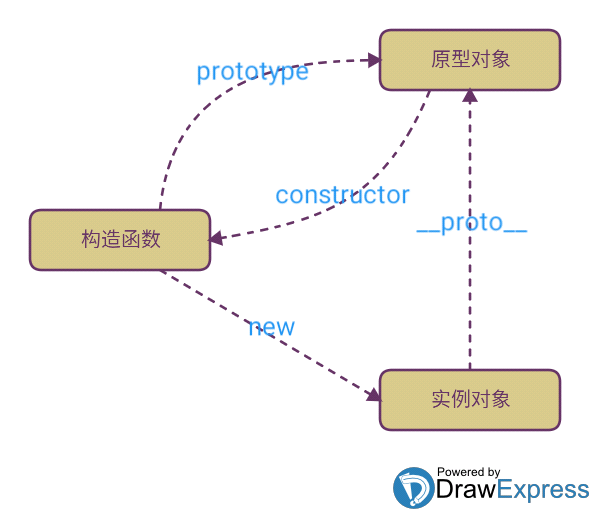

1：[如何理解执行上下文](#jump1);<br />
2：[如何理解作用域链](#jump2);<br />
3：[如何理解原型链](#jump3);<br />
4：[什么是闭包](#jump4);<br />
5：[export和export default的区别？](#export);<br />
6：[继承有哪些方法](#jicheng);<br />
7：[什么是深/浅拷贝，有哪些实现方式](#copy);<br />
8：[数组有哪些常用方法](#array);<br />
9：[数组去重](#array1);<br />
10：[原型](#proto);<br />
<br/>
<br/>
<br/>
<br/>
<br/>
<br/>
<br/>
<br/>
<br/>
<br/>
<br/>
<br/>
<br/>
<br/>
<br/>
<br/>
<br/>
<br/>
<br/>
<br/>
<br/>

- - - 
### <a id="jump1">1:如何理解执行上下文-（包含了变量、作用域链和this）</a>
执行上下文可以理解为当前代码的运行环境。<br />
在 JavaScript 中，运行环境主要包含了**全局环境**和**函数环境**。<br />
在 JavaScript 代码运行过程中，最先进入的是全局环境，而在函数被调用时则进入相应的函数环境。
执行上下文是以栈（一种 LIFO 的数据结构）的方式被存放起来的，我们称之为执行上下文栈

在 JavaScript 代码开始执行时，首先进入全局环境，此时全局上下文被创建并入栈，之后当调用函数时则进入相应的函数环境，此时相应函数上下文被创建并入栈，
当处于栈顶的执行上下文代码执行完毕后，则会将其出栈。<br />

[JavaScript 之深入理解执行上下文](https://www.jianshu.com/p/0d2fb2f2f52c "Title")
### <a id="jump2">2:如何理解作用域链</a>
当前环境向父级一层一层查找变量的过程
### <a id="jump3">3:如何理解原型链</a>
每个函数都拥有一个prototype属性，每个函数实例对象都拥有一个__proto__属性，而这个属性指向了函数的prototype，<br />
当我们访问实例对象的属性或者方法时，会先从自身构造函数中查找，如果没有就通过__proto__去原型中查找，这个查找的过程我们称之为原型链。



[说说原型（prototype）、原型链和原型继承](https://zhuanlan.zhihu.com/p/35790971)

### <a id="jump4">4:什么是闭包</a>
简单理解就是**函数中嵌套函数**。我们都知道局部变量我们是无法访问的，但是通过闭包可以做到。

闭包的定义即：函数 A 内部有一个函数 B，函数 B 可以访问到函数 A 中的变量，那么函数 B 就是闭包

**优点**：<br/>
    1.希望一个变量长期存储在内存中。<br/>
    2.避免全局变量的污染。<br/>
    3.私有成员的存在。<br/>
**缺点**：<br />
1.常驻内存，增加内存使用量。<br />
2.使用不当会很容易造成内存泄露。

### <a id="export">5:export和export default的区别？</a>
```
 export default  xxx<br/>
 import xxx from './'
 
 export xxx <br />
 import {xxx} from './'
``` 
 1.export default 用于规定模块的默认对外接口<br/>
 2.很显然默认对外接口只能有一个，所以 export default 在同一个模块中只能出现一次<br/>
 3.export default只能直接输出，不能先定义再输出。
 
### <a id="jicheng">6:继承有哪些方法</a>
一：借助构造函数实现继承<br/>
原理就是在Child里面,把Parent的this指向改为是Child的this指向,从而实现继承
```
function Parent(name){
    this.name=name;
    }
    Parent.prototype.saiHi=function(){
        console.log("hello")
    }
    function Child(name,age,gender){
        Parent.call(this,name)
        this.age=age;
        this.gender=gender;
    }
    let child=new Child("王磊",20,"男")
    console.log(child.name);// 王磊
    child.sayHi(); // Uncaught TypeError:child.sayHi is not a function
```
*缺点*:只能解决**属性**的继承,使用属性的值不重复,但是父级类别的方法不能继承

二：借助原型链实现继承
原理就是把Child的原型改为是Parent的实例,从而实现继承
```
        function Parent(name,gender){
            this.name=name;
            this.gender=gender;
            this.list=[1,2,3]
        }
        Parent.prototype.eat=function(){
            console.log("晚餐时间到")
        }
        function Child(age){
            this.age=age;
        }
        Child.prototype=new Parent("李白","男");
        var child=new Child(20);
        var child2=new Child(30);
        child.eat();
        console.log(child.list,child2.list);// [1,2,3] [1,2,3]
        child.list.push(4)
        console.log(child.list);// [1,2,3,4]        
        console.log(child2.list);// [1,2,3,4]
```  
缺点:因为Child的原型对象都是New Parent,所以实例化出来的对象的属性都是一样的,而且Parent上面的引用类型只要有一个实例对象修改了,其他也会跟着修改.因为他们原型对象都是共用的<br/>
三：组合型<br/>
```
        function Person(school){
            this.school=school;
        }
        Person.prototype.skill=function(){
            console.log("学习");
        }
        function Student(school,name,age,gender){
            Parent.call(this,school);
            this.name=name;
            this.age=age;
            this.gender=gender;
        }
        Student.prototype=Person.prototype;
        let student=new Student("广铁一中","王菲菲",14,"女");
        console.log(Student.prototype===Person.prototype)
        console.log(student.constructor)
```
缺点:父类的原型对象调用了两次,没有必要,而且student实例的构造函数是来自于Person<br />
四：组方式优化
```
        function Parent(name,play){
            this.name=name;
            this.play=play;
        }
        function Child(name,play,age){
            Parent.call(this,name,play);
            this.age=age;
        }
        Child.prototype=Object.create(Parent.prototype);// 隔离了父类和子类的构造函数,父类的添加到了__proto__属性上
        Child.prototype.constructor=Child
        let child=new Child("张三","玩",20);
        let child2=new Child("李四","吃",10)
       
        console.log(child.constructor)
```
*你必须得理解Object.create()方法的使用,他创建的对象是在原型上面的*
### <a id="copy">7：什么是深/浅拷贝，有哪些实现方式</a>
JS数据类型分别基本数据类型和引用数据类型，基本数据类型保存的是**值**，引用类型保存的是**引用地址(this指针)**

浅拷贝**修改副本，不会影响原数据**，但缺点是浅拷贝只能拷贝第一层的数据，且都是值类型数据，如果有引用型数据，修改
副本会影响原数据。

当要拷贝的数据中含有undefined/function/symbol类型是无法进行拷贝的，当然我们想项目开发中需要
**深拷贝的数据一般不会含有以上三种类型**，如有需要可以自己在封装一个函数来实现。
浅拷贝方法：

+ 直接对象复制<br/>
    ```
    let a = [0,1,2,3,4],
        b = a;
    console.log(a === b);
    a[0] = 1;
    console.log(a,b);
    ```
+ Object.assign<br/>
    Object.assign() 方法可以把任意多个的源对象自身的可枚举属性拷贝给目标对象，然后返回目标对象。
    ```
    let obj1 = {
       a: { b: 1},
       c: 2
    }
    let obj2 = Object.assign({},obj1)
    obj2.a.b = 3;  //第二层，obj1变了，是浅拷贝
    obj2.c = 3;  //第一层，obj1不变，是深拷贝
    console.log(obj1);  
    console.log(obj2); 
    ```
深拷贝方法:
    
+ JSON.stringify转为字符串再JSON.parse<br/>
    ```
    function deepClone(obj) {
        let _obj = JSON.stringify(obj)
        let objClone = JSON.parse(_obj)
        return objClone
    }
     
    let a = [0, 1, [2, 3], 4]
    let b = deepClone(a)
    a[0] = 1
    a[2][0] = 1
    console.log(a)  // [1,1,[1,3],4]
    console.log(b)  // [0,1,[2,3],4]
    ```
+ 深度递归遍历
    ```
    function deepClone(obj) {
      let objClone = Array.isArray(obj) ? [] : {} //根据类型制造一个新的数组或对象 Array.isArray判断是否是数组
      if (obj && typeof obj === 'object') {
        for (let key in obj) {
          if (obj.hasOwnProperty(key)) {
            // 判断obj子元素是否为对象，如果是对象，递归复制
            if (obj[key] && typeof obj[key] === 'object') {
              objClone[key] = deepClone(obj[key])
            // 如果是基本数据类型，只是简单的复制
            } else {
              objClone[key] = obj[key]
            }
          }
        }
      }
      return objClone
    }
     
    let a = [1,2,3,4]
    let b = deepClone(a)  
    a[0] = 2 
    console.log(a)  // [2,2,3,4]
    console.log(b)  // [1,2,3,4]
    ```
+ jquery实现深拷贝$.extend
    ```
    var array1 = [1,2,3,4];
    var array2 = $.extend(true,[],array); // true为深拷贝，false为浅拷贝
    console.log(array1 === array2);  // false
    ```
### <a id="array">8：数组有哪些常用方法</a>
+ push 末尾添加
+ pop 末尾删除
+ shift 首部删除
+ unshift 首部添加
+ concat 数组合并
+ join 数组元素 通过连接符 连接
+ reverse 数组反转
+ sort 数组排序
+ map/forEach/filter/indexOf/includes/slice/splice
+ slice表示截取，slice(start,end)不改变原数组，返回新数组。
+ splice表示删除，splice(start,length,item)，会改变原数组，从某个位置开始删除多个元素，并可以插入新的元素。
### <a id="array1">9：数组去重</a>
+ Array.from(new Set(a))

### <a id="proto">10：原型</a>
构造函数是一种特殊的方法，主要用来在创建对象时初始化对象。<br />
每个构造函数都有prototype(原型)(箭头函数以及Function.prototype.bind()没有)属性，
这个prototype(原型)属性是一个指针，指向一个对象，这个对象的用途是包含特定类型的所有实例共享的
属性和方法，即这个原型对象是用来给实例对象共享属性和方法的。每个实例对象的__proto__都指向这个
构造函数/类的prototype属性.

+ new执行的函数, 函数内部默认生成了一个对象

+ 函数内部的this默认指向了这个new生成的对象

+ new执行函数生成的这个对象, 是函数的默认返回值

### <a id="vuex">11：vuex</a>
vuex是一个专为vue.js应用程序开发的**状态管理**器，它采用集中式存储管理应用的所有组件的状态，并且以相
应的规则保证状态以一种可以预测的方式发生变化。

+ state: vuex使用单一状态树，用一个对象就包含来全部的应用层级状态

+ mutation: 更改vuex中state的状态的唯一方法就是提交mutation

+ action: action提交的是mutation，而不是直接变更状态，action可以包含任意异步操作

+ getter: 相当于vue中的computed计算属性
